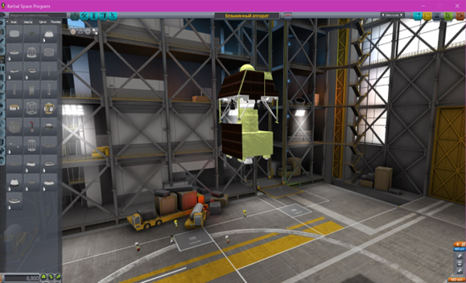
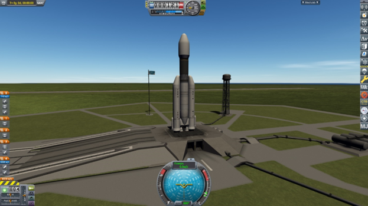
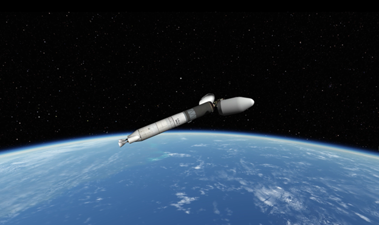
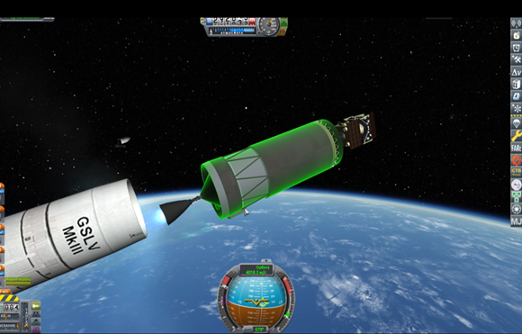

# Chandrayaan-3

### Состав команды

* Корочин Владислав Алексеевич (101Б) - Тимлид, ответственный за любые вычисления (физик)
* Кутьков Максим Игоревич (101Б) -ответственный за поиск достоверной информации и программист и за моделирование в Kerbal Space Program (KSP)
* Закревский Владислав Анатольевич (101Б) - ответственный за создание отчёта и видео презентации. Программист
* Митрофанов Олег Русланович (101Б) - ответственный за моделирование в Kerbal Space Program (KSP).

### Модель ракеты создана в конструкторе Kerbal Space Program

### Программы

* Программа для [логирования высоты](https://github.com/KaurDanil/Chandrayaan-3/blob/main/log_altitude.py)
* Программа для [логирования скорости](https://github.com/KaurDanil/Chandrayaan-3/blob/main/log_velocity.py)
* Программа [сравнивающая математическую модель взлета и данные KSP](https://github.com/KaurDanil/Chandrayaan-3/blob/main/making_graphics.py)
* Программа для [автопилота](https://github.com/KaurDanil/Chandrayaan-3/blob/main/autopilot_chandrayaan-3.py)

### Ссылка на материалы проекта и видео
